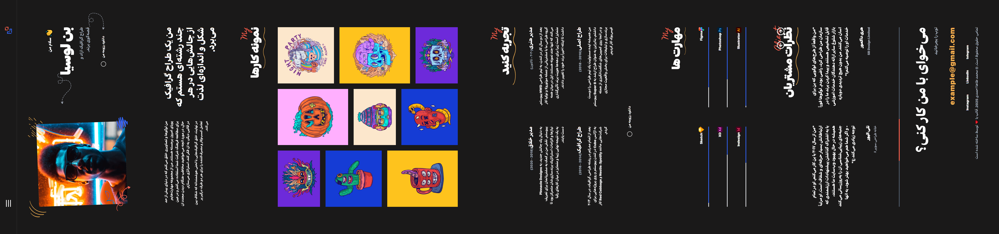

# Persianized Website

A Persianized and RTL version of a personal resume and portfolio template built with HTML, CSS, and Bootstrap.

The project focused on adapting the original template for Persian users by converting the layout to right-to-left (RTL), adjusting the interface for Persian content, and maintaining a responsive experience across different screen sizes.

## ✨ Features

* Full Persian localization
* Complete RTL layout
* Responsive design
* Persian-friendly user interface
* Adapted resume and portfolio sections
* Bootstrap-based layout
* Custom CSS adjustments for Persian content
* Suitable for personal resume and portfolio websites

## 🛠️ Technologies

* HTML5
* CSS3
* Bootstrap
* Responsive Web Design
* RTL Layout

## 🎯 Project Goal

The main goal of this project was to practice localizing an existing web template for Persian users and gain experience with RTL layouts, Bootstrap, responsive design, and adapting interfaces for Persian content.

---

# فارسی‌سازی قالب رزومه و پورتفولیو

این پروژه نسخه فارسی و راست‌چین‌شده یک قالب رزومه و پورتفولیو است که با استفاده از HTML، CSS و Bootstrap ساخته شده بود.

در این پروژه قالب اصلی برای استفاده در زبان فارسی آماده‌سازی شد و بخش‌های مختلف آن به‌صورت راست‌چین (RTL) تنظیم شدند. همچنین ظاهر بخش‌ها و استایل‌های موردنیاز برای نمایش صحیح محتوای فارسی بهینه‌سازی شد.

## ✨ ویژگی‌ها

* فارسی‌سازی کامل قالب
* راست‌چین‌کردن (RTL) رابط کاربری
* طراحی واکنش‌گرا
* سازگاری رابط کاربری با محتوای فارسی
* بخش‌های رزومه و نمونه‌کار
* استفاده از Bootstrap
* اعمال تغییرات CSS برای نمایش بهتر محتوای فارسی
* مناسب برای وب‌سایت‌های رزومه و پورتفولیو شخصی

## 🛠️ تکنولوژی‌های استفاده‌شده

* HTML5
* CSS3
* Bootstrap
* طراحی واکنش‌گرا (Responsive Web Design)
* ساختار راست‌چین (RTL)

## 🎯 هدف پروژه

هدف اصلی این پروژه، تمرین فارسی‌سازی و راست‌چین‌کردن یک قالب آماده و کسب تجربه در زمینه پیاده‌سازی رابط‌های RTL، استفاده از Bootstrap و سازگارکردن طراحی وب با محتوای فارسی بوده است.

## 📸 Screenshots

### Website Preview

### Poster

